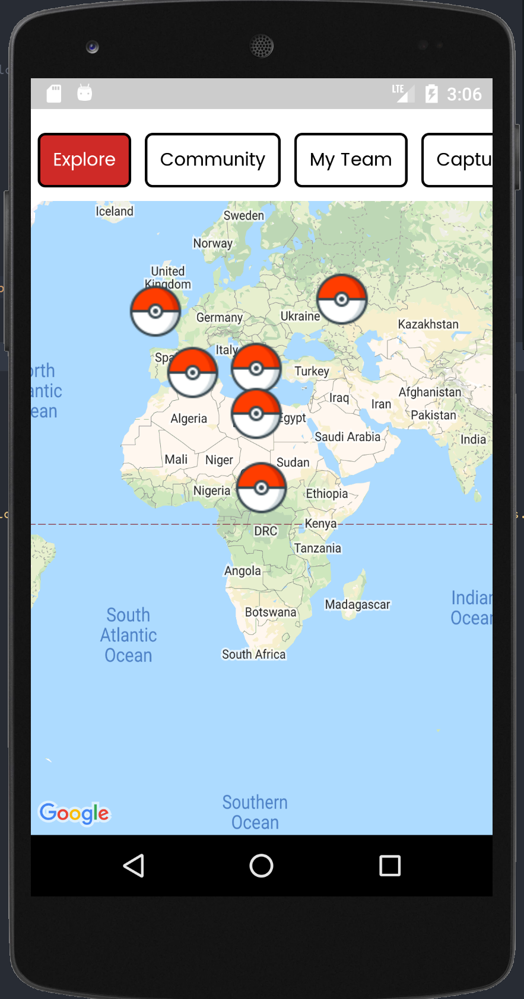
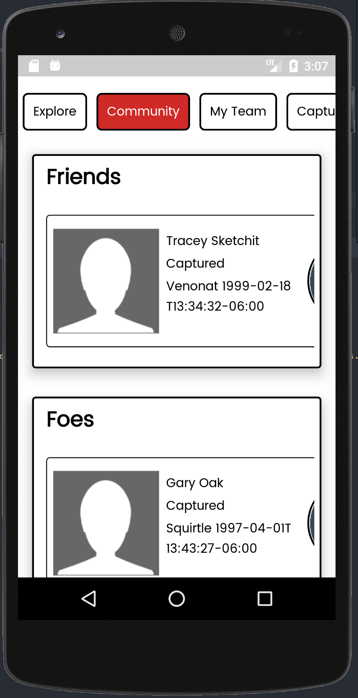
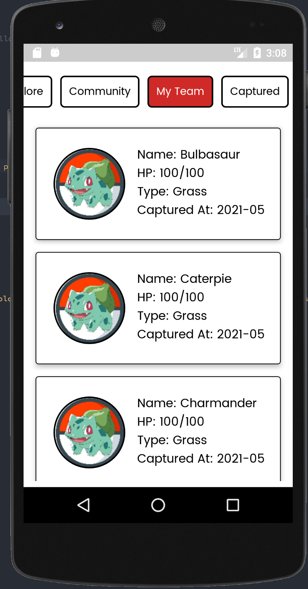
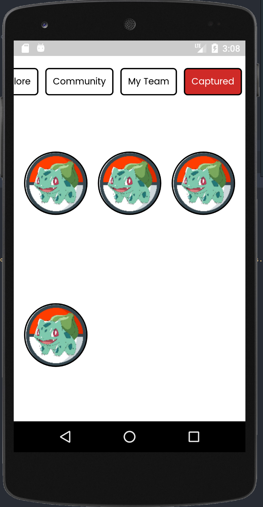
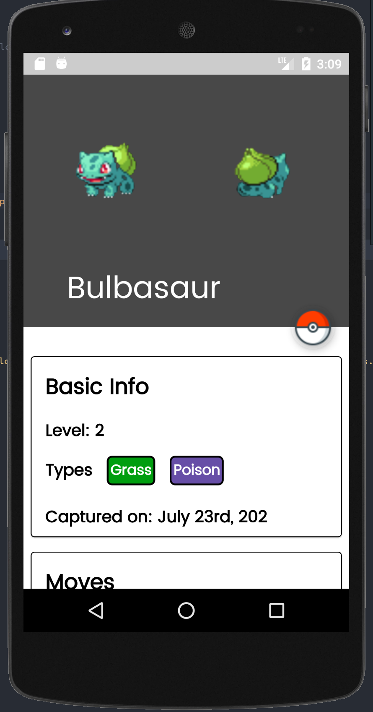
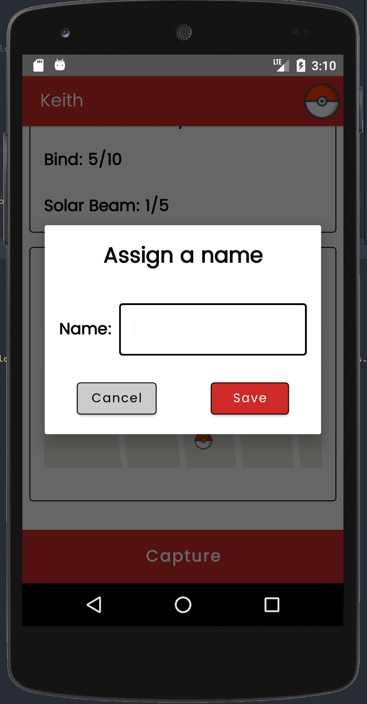

# PokemonGo Simulation Android App

  an app that simulates some of the functionalities of the successful mobile game PokemonGO using the official Android SDK and its frameworks.

  Minimum Api Level : 21 compileSdkVersion : 30

  Build System : [Gradle](https://gradle.org/)

    

    

  

  Download APK: https://github.com/chydee/PokemonGO-Android-App/releases/tag/v1.0

## INSTRUCTIONS:

 Your task is to implement both functions back to app with following conditions:

**1. Create an app that simulates some of the functionalities of the successful mobile game PokemonGO using the official Android SDK and its frameworks.

**2. Make sure to use git a Source Code Version Manager and make a different commit for each of milestone and leave very descriptive commit messages.

**3. All code must be implemented using kotlin

Full Task Instructions: https://github.com/givesafe/senior-android-assignment

## Getting Started
   This project uses AndroidX dependencies.
   This means you would need to have Android Studio 3.2.1 or later and AndroidX installed. With this, you can get started with the following steps:
   Follow these steps if you want to get a local copy of the project.

   Prerequisites
   Android Studio IDE 3.0+
   Android SDK v28
   Android Build Tools v28.0.3
   Gradle 4.10.1
   1. Clone or fork the repository (Master Branch) by running the command below
   on your git terminal

   git clone https://github.com/chydee/PokemonGO-Android-App.git
   2. Import the project in AndroidStudio, and add API Key
   In Android Studio, go to File -> New -> Import project
   Follow the dialog for set up instructions

   To test this application, please use an Android device or emulator (OS 5.0 or newer).

## WHAT WAS DONE:
**Understand the Task** - Before proceeding with coding the features I had to understand the problem, how to approach it,
  ways to achieve what was expected.
**Leveraged on resources to make process faster** - I Google some concepts and also search stackoverflow for possible solutions to problems I faced

## WHAT I WOULD DO BETTER:
 If I had enough time I'd have written Unit, Integration and UI tests for the different classes, fragments and/or activities implemented

